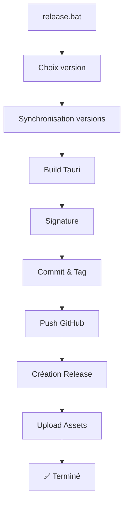

# 🚀 Guide de Release Automatique - Formalyse

## ✅ Modifications apportées

### 1. **Nouveau script de création de release GitHub**
- **Fichier** : `create-release-github.ps1`
- **Fonction** : Crée automatiquement une release GitHub via l'API
- Supprime l'ancienne release si elle existe
- Upload automatique de tous les assets (EXE, MSI, latest.json)
- Gestion complète des erreurs
- Interface utilisateur améliorée

### 2. **Script de synchronisation amélioré**
- **Fichier** : `sync-versions.ps1` 
- **Correction** : Compatible PowerShell 5.1 et 7+
- Utilise `System.Text.UTF8Encoding` pour éviter les problèmes de BOM
- Garantit un encodage UTF-8 sans BOM pour tous les fichiers

### 3. **Script de release simplifié**
- **Fichier** : `release.bat`
- Intègre maintenant la création automatique de la release GitHub
- Plus besoin de `upload-release.bat` séparé

## 🎯 Utilisation

### Release complète (recommandé)

```batch
release.bat
```

Ce script va automatiquement :
1. ✅ Demander le type de version (patch/minor/major/manuel)
2. ✅ Incrémenter et synchroniser les versions
3. ✅ Builder l'application Tauri
4. ✅ Signer les fichiers et générer `latest.json`
5. ✅ Commit et tag Git
6. ✅ Push sur GitHub
7. ✅ **Créer automatiquement la release GitHub avec tous les fichiers** 🎁

### Configuration du token GitHub

#### Option 1 : Variable d'environnement permanente (recommandé)

```batch
# PowerShell (administrateur)
[System.Environment]::SetEnvironmentVariable('GITHUB_TOKEN', 'ghp_votre_token_ici', 'User')
```

#### Option 2 : Token temporaire

Le script `release.bat` vous demandera le token si il n'est pas configuré.

#### Créer un token GitHub

1. Allez sur : https://github.com/settings/tokens/new
2. Nom : `Formalyse Release Token`
3. Permissions requises :
   - ✅ `repo` (Full control of private repositories)
   - ✅ `write:packages` (Upload packages)
4. Cliquez sur "Generate token"
5. Copiez le token (commence par `ghp_...`)

## 📝 Processus de release étape par étape

### Étape 1 : Lancer le script

```batch
release.bat
```

### Étape 2 : Choisir le type de version

```
1. Patch (1.0.4 => 1.0.5)  - Correctifs mineurs
2. Minor (1.0.4 => 1.1.0)  - Nouvelles fonctionnalités
3. Major (1.0.4 => 2.0.0)  - Changements majeurs
4. Manuelle                - Saisir manuellement (ex: 2.1.3)
```

### Étape 3 : Build automatique

Le script va :
- Synchroniser les versions dans tous les fichiers
- Compiler l'application Tauri (2-3 minutes)
- Vous demander le mot de passe de votre clé privée pour la signature

### Étape 4 : Push et release

- Commit et tag Git automatiques
- Push sur GitHub
- **Création automatique de la release avec upload des fichiers** 🎉

## 🔧 Scripts disponibles

### `release.bat` - Script principal
Processus complet de A à Z avec création automatique de la release GitHub.

### `sync-versions.ps1` - Synchronisation des versions
Peut être utilisé indépendamment :
```powershell
.\sync-versions.ps1 -Version "1.0.5"
```

### `create-release-github.ps1` - Création de release
Peut être utilisé indépendamment si vous avez déjà buildé :
```powershell
.\create-release-github.ps1 -Version "1.0.5" -GithubToken "ghp_..." -Owner "yoyoboul" -Repo "formalyse"
```

### `sign-and-generate-json.ps1` - Signature
Signe le build et génère `latest.json` :
```powershell
.\sign-and-generate-json.ps1 -Version "1.0.5"
```

## ❌ Anciens scripts (obsolètes)

Ces scripts ne sont plus nécessaires :
- ❌ `upload-release.bat` - Remplacé par l'intégration dans `release.bat`
- ⚠️ `create-github-release.ps1` - Ancien script (conservé pour compatibilité)
- ⚠️ `create-release-simple.ps1` - Ancien script (conservé pour compatibilité)

## 🐛 Résolution de problèmes

### Erreur d'encodage UTF-8

**Symptôme** : `stream did not contain valid UTF-8`

**Solution** : Les fichiers sont maintenant automatiquement nettoyés. Si le problème persiste :
```powershell
# Réinitialiser les fichiers
git restore package.json src-tauri/tauri.conf.json
```

### Token GitHub invalide

**Symptôme** : `401 Unauthorized` ou `Bad credentials`

**Solution** :
1. Vérifiez que votre token est valide
2. Vérifiez les permissions (repo + write:packages)
3. Réessayez avec un nouveau token

### Build échoue

**Symptôme** : Erreur pendant `npm run tauri:build`

**Solution** :
```batch
# Nettoyer et réessayer
rmdir /s /q dist
rmdir /s /q src-tauri\target
npm run tauri:build
```

### La release existe déjà

Le script supprime automatiquement l'ancienne release si elle existe avec le même tag.

## 📊 Workflow complet



## 🎉 Avantages

✅ **Un seul script** : Plus besoin de 2 scripts séparés  
✅ **Automatique** : Création de release et upload en une seule commande  
✅ **Robuste** : Gestion d'erreurs complète  
✅ **Compatible** : Fonctionne avec PowerShell 5.1 et 7+  
✅ **Encodage fixe** : Plus de problèmes UTF-8/BOM  
✅ **Sécurisé** : Utilise l'API GitHub officielle  

## 📚 Documentation API GitHub

- [Releases API](https://docs.github.com/en/rest/releases/releases)
- [Upload Assets](https://docs.github.com/en/rest/releases/assets)
- [Personal Access Tokens](https://docs.github.com/en/authentication/keeping-your-account-and-data-secure/creating-a-personal-access-token)

## 🔗 Liens utiles

- [Tauri Documentation](https://tauri.app/v1/guides/)
- [GitHub Actions](https://github.com/yoyoboul/formalyse/actions)
- [Releases](https://github.com/yoyoboul/formalyse/releases)

